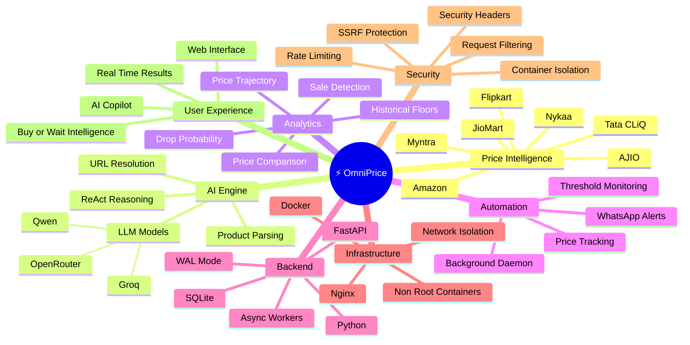
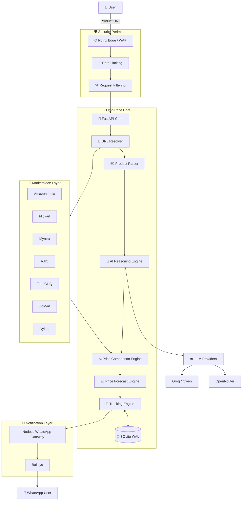
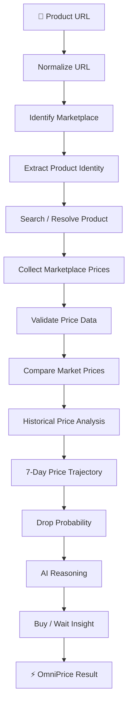
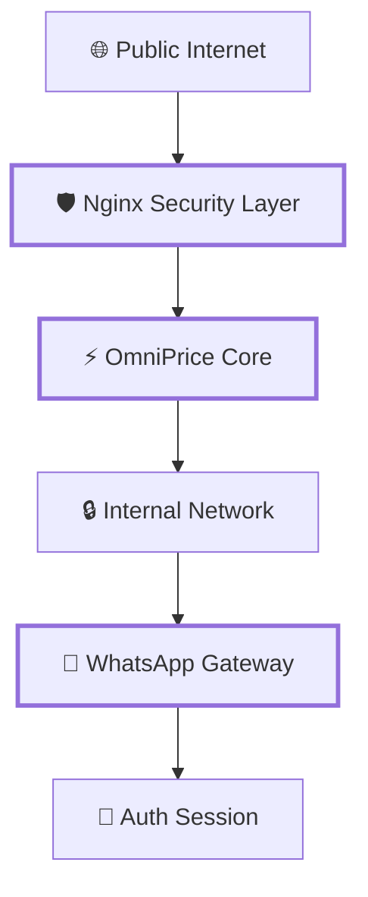
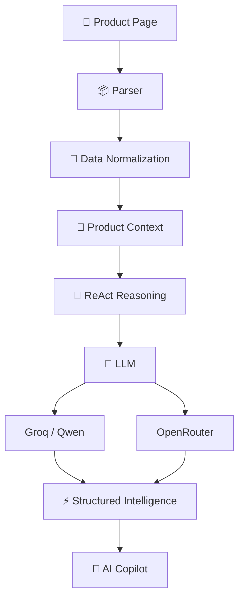
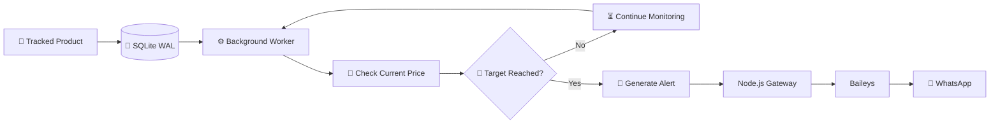
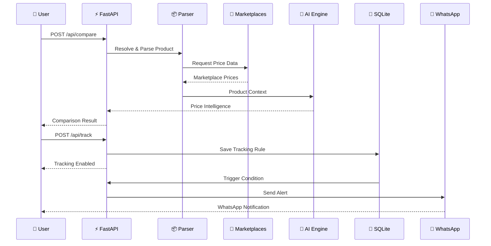
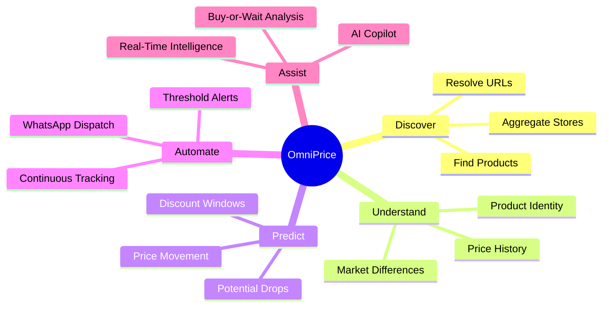

<div align="center">

# ⚡ OmniPrice

### Autonomous Price Intelligence & Real-Time Retail Arbitrage Engine

[](#)
[](#)
[](#)
[](#)
[](#)

**Real-time multi-store price intelligence, AI-powered product parsing,  
price forecasting, automated tracking, and WhatsApp alerts.**

<br>

**[Explore Capabilities](#-core-capabilities) • [Architecture](#-system-architecture) • [Flow](#-execution-flow) • [Quickstart](#-quickstart) • [API](#-api-endpoints)**

</div>

---

# 🧠 What is OmniPrice?

**OmniPrice** is an autonomous price intelligence platform designed to discover, compare, monitor, and analyze product prices across multiple Indian e-commerce marketplaces.

Instead of manually checking several stores, OmniPrice creates a unified **market intelligence layer** that can:

- Resolve product URLs
- Extract product information
- Compare prices across marketplaces
- Detect price differences
- Analyze historical price movement
- Predict potential price drops
- Monitor products continuously
- Notify users through WhatsApp
- Provide AI-assisted buy-or-wait insights

The system combines **FastAPI, Python, AI reasoning models, marketplace adapters, SQLite, Docker, Node.js, and WhatsApp automation** into a single autonomous pipeline.

---

# ⚡ Core Capabilities

| Capability | Description |
|---|---|
| 🛒 Multi-Store Intelligence | Compare prices across major Indian marketplaces |
| ⚡ Fast Marketplace Retrieval | Fast-path marketplace API/RPC integrations |
| 🤖 AI Product Parser | Extract product intelligence from difficult pages |
| 📈 Price Forecasting | Analyze historical movement and potential price drops |
| 🎯 Price Tracking | Continuously monitor user-defined thresholds |
| 📲 WhatsApp Radar | Send automated price alerts |
| 🧠 AI Copilot | Assist users with product and pricing decisions |
| 🛡️ Security Layer | SSRF protection, isolation and hardened containers |
| 🐳 Docker Deployment | Production-oriented containerized architecture |
| 💾 SQLite WAL | Reliable background tracking and dispatch state |

---

# 🗺️ OmniPrice Mind Map



---

# 🏗️ System Architecture



---

# 🔄 Execution Flow

```mermaid
flowchart LR

    A["👤 User<br/>Product URL"]

    --> B["🌐 Request"]

    --> C["🛡️ Security Layer"]

    --> D["🔗 URL Resolver"]

    --> E["📦 Product Extraction"]

    --> F["🛒 Marketplace Queries"]

    --> G["⚖️ Price Aggregation"]

    --> H["📈 Price Analysis"]

    --> I["🧠 AI Reasoning"]

    --> J["🎯 Buy / Wait Intelligence"]

    --> K["📊 Result"]

    --> L["📲 WhatsApp Alert"]

    K --> M["👤 User"]
    L --> M
```



---

# 🔬 Price Intelligence Pipeline



---

# 🛡️ Security Architecture

OmniPrice follows a **defense-in-depth architecture** where public traffic, application logic, and messaging infrastructure are isolated.



### Security Controls

#### 🛡️ Request Filtering

Suspicious requests can be filtered before reaching the application layer.

Examples include:

```text
/.env
/admin
/wp-login.php
SQL injection patterns
unexpected request signatures
```

#### 🔐 SSRF Protection

Target URLs are validated before outbound requests are made.

Protected destinations include:

```text
127.0.0.0/8
10.0.0.0/8
172.16.0.0/12
192.168.0.0/16
169.254.169.254
localhost
loopback interfaces
```

#### 👤 Least Privilege

The application container is designed to run without unnecessary root privileges.

```text
Application
     │
     ▼
Non-root User
     │
     ▼
Restricted Capabilities
```

#### 🔒 Network Isolation

The WhatsApp gateway is separated from direct public exposure.

```text
Internet
   │
   ▼
Nginx
   │
   ▼
OmniPrice Core
   │
   ▼
Internal Docker Network
   │
   ▼
WhatsApp Gateway
```

---

# 🧠 AI Architecture



---

# 📲 24/7 WhatsApp Radar

OmniPrice can continuously monitor tracked products and dispatch notifications when configured conditions are reached.



---

# 📊 Price Intelligence Model

OmniPrice combines several signals instead of relying only on the current price.

```text
Current Price
      │
      ├── Historical Floor
      │
      ├── Price Movement
      │
      ├── Marketplace Difference
      │
      ├── Sale / Event Signals
      │
      ├── Recent Drops
      │
      └── Target Threshold
              │
              ▼
       🧠 Price Intelligence
              │
              ▼
       Buy / Wait Insight
```

Potential event signals include:

```text
Big Billion Days
Great Indian Festival
End of Reason Sale
Flash Sales
Marketplace Promotions
```

---

# 🚀 Quickstart

## 1. Clone Repository

```bash
git clone https://github.com/AkshatRaj00/omniprice.git
cd omniprice
```

## 2. Configure Environment

```bash
cp .env.example .env
```

Add the required API keys:

```env
GROQ_API_KEY=your_groq_api_key
OPENROUTER_API_KEY=your_openrouter_api_key
WHATSAPP_GATEWAY=http://127.0.0.1:5001/send-message
```

---

# 🐳 Docker Deployment

```bash
docker compose up -d --build
```

Check running services:

```bash
docker compose ps
```

View logs:

```bash
docker compose logs -f
```

Stop the cluster:

```bash
docker compose down
```

---

# 💻 Local Development

## Python Core

Create a virtual environment:

```bash
python -m venv venv
```

### Windows

```powershell
.\venv\Scripts\activate
```

### Linux / macOS

```bash
source venv/bin/activate
```

Install dependencies:

```bash
pip install -r requirements.txt
```

Start FastAPI:

```bash
python -m uvicorn main:app --reload --port 8000
```

---

# 📲 WhatsApp Gateway

```bash
cd whatsapp_gateway
npm install
npm start
```

Pair the gateway using the generated WhatsApp QR code.

---

# 📡 API Endpoints

| Method | Endpoint | Purpose |
|---|---|---|
| `POST` | `/api/compare` | Compare product prices across marketplaces |
| `POST` | `/api/track` | Start price tracking |
| `POST` | `/api/agent/chat` | Interact with the AI Copilot |
| `GET` | `/robots.txt` | Crawler instructions |
| `GET` | `/sitemap.xml` | Dynamic sitemap |

---

# 🔌 API Flow



---

# 🗂️ Project Structure

```text
omniprice/
│
├── main.py
├── requirements.txt
├── .env.example
├── docker-compose.yml
├── Dockerfile
├── nginx/
│   └── nginx.conf
│
├── core/
│   ├── parser/
│   ├── marketplace/
│   ├── forecasting/
│   ├── tracking/
│   └── security/
│
├── whatsapp_gateway/
│   ├── package.json
│   ├── index.js
│   └── auth/
│
├── static/
├── templates/
│
├── README.md
├── CONTRIBUTING.md
└── SECURITY.md
```

---

# 🧩 Technology Stack

```text
                    ⚡ OmniPrice
                         │
        ┌────────────────┼────────────────┐
        │                │                │
     Backend           AI Layer       Automation
        │                │                │
     FastAPI           Groq            Node.js
     Python            Qwen            Baileys
     SQLite            OpenRouter      WhatsApp
        │
     Docker
        │
     Nginx
```

### Backend

- Python
- FastAPI
- SQLite
- Async processing

### AI

- Groq
- Qwen
- OpenRouter
- ReAct-style reasoning

### Automation

- Node.js
- Baileys
- Background workers
- WhatsApp notifications

### Infrastructure

- Docker
- Docker Compose
- Nginx
- Isolated networks

---

# 🔥 Why OmniPrice?

Traditional shopping requires:

```text
Search Store A
      ↓
Search Store B
      ↓
Search Store C
      ↓
Compare Prices
      ↓
Check History
      ↓
Wait for Discount
      ↓
Check Again
```

OmniPrice turns the workflow into:

```text
              🔗 Product URL
                    │
                    ▼
             ⚡ OmniPrice
                    │
        ┌───────────┼───────────┐
        ▼           ▼           ▼
     Compare     Analyze      Monitor
        │           │           │
        └───────────┼───────────┘
                    ▼
              🧠 Intelligence
                    │
              ┌─────┴─────┐
              ▼           ▼
           Buy Now      Wait
              │           │
              └─────┬─────┘
                    ▼
              📲 Alert User
```

---

# 🎯 Project Vision



---

# 🤝 Contributing

Contributions are welcome.

```bash
git checkout -b feature/your-feature
```

Make your changes and run:

```bash
pip install ruff
ruff check .
```

Commit:

```bash
git add .
git commit -m "feat: add your feature"
```

Push:

```bash
git push origin feature/your-feature
```

Then open a Pull Request.

---

# 🔐 Security

If you discover a security vulnerability, please avoid publicly exposing sensitive details.

Review:

```text
SECURITY.md
```

before submitting a security report.

---

# 📄 License

OmniPrice is distributed under the **Apache License 2.0**.

Maintained by **OnePersonAI**.

---

<div align="center">

# ⚡ OmniPrice

### Price Intelligence. Automation. AI.

**Built by OnePersonAI**

</div>
